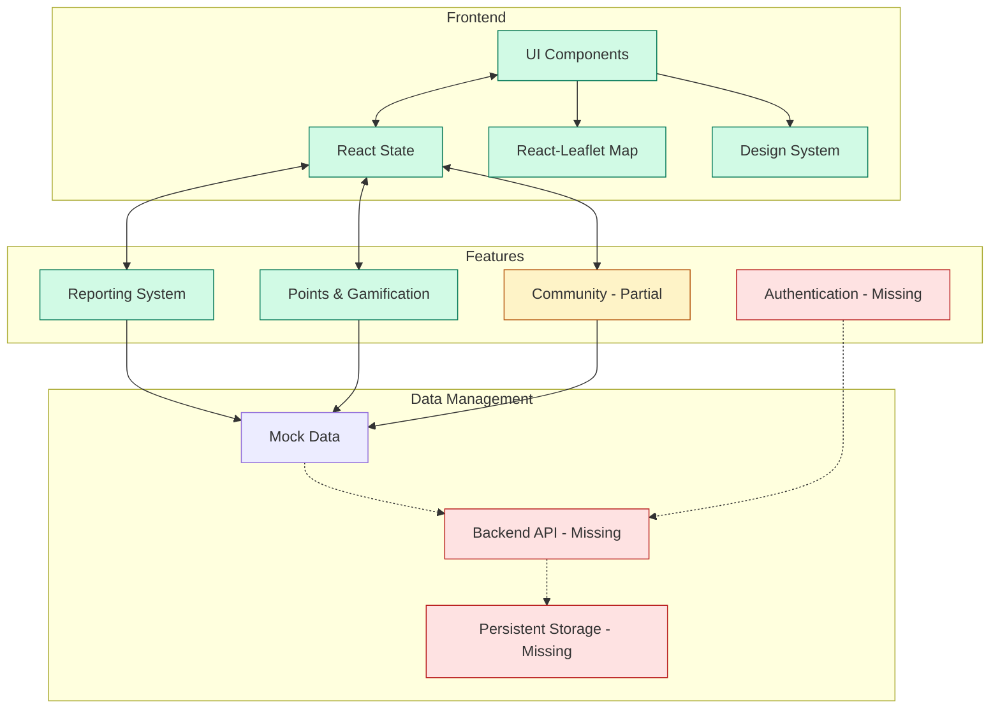

# GreenSentinel Citizen App - Architecture Documentation

## High-Level Architecture



## Repository Structure

```
GreenSentinel-Citizen-App/
├── .idea/                       # IDE configuration files (IntelliJ/WebStorm)
├── node_modules/                # Node.js dependencies (not detailed)
├── public/                      # Static assets served directly
│   ├── index.html               # Main HTML entry point
│   └── logo-GreenSentinel-without-backgroung.png
├── src/                         # Source code
│   ├── assets/                  # Static assets imported by components
│   ├── components/              # React components
│   │   └── GreenSentinel.js     # Main application component
│   ├── App.js                   # Root React component
│   ├── index.css                # Global CSS
│   ├── index.js                 # Application entry point
│   └── logo-GreenSentinel-without-backgroung.png
├── design-tokens.json           # Design tokens in style-dictionary format
├── design-system.md             # Design system documentation
├── package.json                 # Project metadata and dependencies
├── package-lock.json            # Locked dependency versions
├── postcss.config.js            # PostCSS configuration for Tailwind
└── tailwind.config.js           # Tailwind CSS configuration
```

## Directory Roles & Responsibilities

| Directory/File | Role & Responsibility |
|----------------|------------------------|
| **public/** | Contains static assets that are served directly without being processed by the build system. Includes the main HTML entry point. |
| **src/** | Contains all source code for the application. |
| **src/assets/** | Static assets that are imported by components and processed by the build system. |
| **src/components/** | React components that make up the UI of the application. Currently contains only the main GreenSentinel component. |
| **design-tokens.json** | Centralized design tokens (colors, typography, spacing, etc.) in style-dictionary format for maintaining consistent UI across platforms. |
| **design-system.md** | Documentation of design system implementation with usage examples for React and Flutter. |
| **postcss.config.js** | PostCSS configuration used by Tailwind CSS. |
| **tailwind.config.js** | Configuration file for Tailwind CSS, defining content paths and theme extensions. |

## Current Code Organization

The application is currently organized as a monolithic React component (`GreenSentinel.js`) with no separation of concerns. All UI components, state management, and mock data handling are contained within this single file, which makes it difficult to maintain and extend.

### Missing Directory Structure

The following directories would typically be present in a well-structured React application but are missing:

- **src/hooks/** - For custom React hooks
- **src/services/** - For API calls and data services
- **src/context/** - For React context and shared state
- **src/utils/** - For utility functions
- **src/pages/** - For page-level components
- **src/features/** - For feature-specific components and logic
- **src/types/** - For TypeScript type definitions

## Feature to Directory Mapping

| Feature | Current Location | Ideal Location |
|---------|------------------|----------------|
| **Authentication** | Not implemented | `src/features/auth/` |
| **Navigation** | Inside GreenSentinel.js | `src/components/navigation/` |
| **Map Interface** | Inside GreenSentinel.js | `src/features/map/` |
| **Reporting System** | Inside GreenSentinel.js | `src/features/reporting/` |
| **Gamification** | Inside GreenSentinel.js | `src/features/gamification/` |
| **User Profile** | Partially in GreenSentinel.js | `src/features/profile/` |
| **Design System** | design-tokens.json, design-system.md | `src/design-system/` |
| **Community** | Placeholder in GreenSentinel.js | `src/features/community/` |
| **Chat** | Not implemented | `src/features/chat/` |

## Major Dependencies

| Dependency | Version | Purpose |
|------------|---------|---------|
| **React** | 18.2.0 | UI framework for building the application |
| **React-Leaflet** | 4.2.1 | React components for Leaflet maps |
| **Leaflet** | 1.9.4 | Interactive map library |
| **Tailwind CSS** | 3.4.1 | Utility-first CSS framework |
| **Lucide React** | 0.321.0 | Icon library for UI elements |
| **React Scripts** | 5.0.1 | Build scripts and configuration |

## Extension Points

### Backend Integration

The application currently uses mock data defined in the GreenSentinel component. To integrate with a backend:

1. Create a services layer:
   ```javascript
   // src/services/api.js
   const BASE_URL = 'https://api.greensentinel.com/v1';
   
   export const fetchReports = async () => {
     const response = await fetch(`${BASE_URL}/reports`);
     return await response.json();
   };
   
   export const submitReport = async (reportData) => {
     const response = await fetch(`${BASE_URL}/reports`, {
       method: 'POST',
       headers: { 'Content-Type': 'application/json' },
       body: JSON.stringify(reportData)
     });
     return await response.json();
   };
   ```

2. Add environment configuration for API endpoints

### Authentication System

Currently missing, should be implemented with:

1. Authentication context:
   ```javascript
   // src/context/AuthContext.js
   export const AuthContext = createContext();
   
   export const AuthProvider = ({ children }) => {
     const [currentUser, setCurrentUser] = useState(null);
     const [loading, setLoading] = useState(true);
     
     // Authentication methods
     
     return (
       <AuthContext.Provider value={{ currentUser, loading, login, logout, register }}>
         {children}
       </AuthContext.Provider>
     );
   };
   ```

2. Protected routes and authorization checks

### Data Persistence

Currently all data is ephemeral and lost on reload. Options for persistence:

1. Backend database (recommended)
2. Local storage for offline capabilities
3. IndexedDB for complex local data

## Missing Pieces Checklist

### Backend Infrastructure

- [ ] REST API or GraphQL server
- [ ] Database schema design
- [ ] Authentication/authorization service
- [ ] File storage for uploaded images
- [ ] Geospatial query capabilities
- [ ] Rate limiting and API security
- [ ] Notification system

### Frontend Development

- [ ] Component modularization
- [ ] State management solution (Context API, Redux, etc.)
- [ ] Form validation library
- [ ] Route management
- [ ] Error boundaries
- [ ] Lazy loading/code splitting
- [ ] Progressive web app capabilities

### Testing

- [ ] Unit tests for components
- [ ] Integration tests for features
- [ ] End-to-end tests for user flows
- [ ] Mock service worker for API testing

### DevOps

- [ ] CI/CD pipeline
- [ ] Deployment strategy
- [ ] Environment configuration
- [ ] Monitoring and logging
- [ ] Performance optimization

### Documentation

- [ ] Component documentation
- [ ] API documentation
- [ ] User guides
- [ ] Contribution guidelines

## Recommended Next Steps

1. **Refactoring**: Break down the monolithic GreenSentinel component into smaller, focused components
2. **State Management**: Implement a proper state management solution
3. **Backend Development**: Create a minimal viable API for saving and retrieving reports
4. **Authentication**: Add user registration and login functionality
5. **Testing**: Implement basic unit tests for core functionality
6. **CI/CD**: Set up a simple deployment pipeline

This architecture document provides a blueprint for evolving the GreenSentinel Citizen App from its current prototype state to a production-ready application with proper separation of concerns and scalability.
